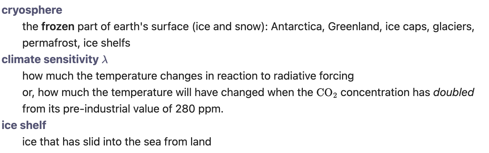

## Definition list

Create a Definition list. This is a reduced and slightly modified form of the functionality for definition lists of the PHP [Markdown Extra](https://michelf.ca/projects/php-markdown/extra/#def-list) module.

### Usage
A definition list consists of one or more *term* – *definition* pairs. The term should be entered at the left of the line, without any spaces in front of it. The definition must then be entered on the next line, in the form of a `:` at the start of the line followed by 3 spaces, followed by the definition:

```
cryosphere
:   the **frozen** part of earth's surface (ice and snow): Antarctica, Greenland, ice caps, glaciers, permafrost, ice shelfs
climate sensitivity $\lambda$
:   how much the temperature changes in reaction to radiative forcing
:   or, how much the temperature will have changed when the $\ce{CO2}$
concentration has *doubled* from its pre-industrial value of 280 ppm.
ECS = equilibrium climate sensitivity
ice shelf
:   ice that has slid into the sea from land
```

Two consecutive definition lines are allowed (as in the second item above), and two consecutive terms are allowed too (as in the last item).

The plugin converts this content to a definition list (as in HTML's `<dl>` element).

The example above then looks like


