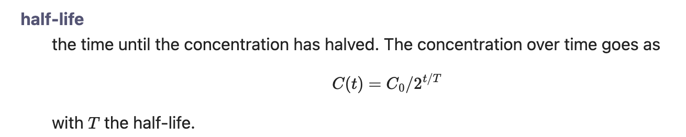
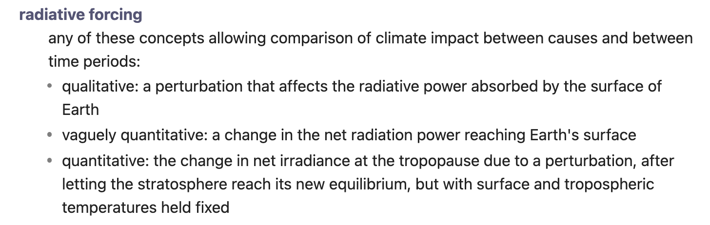

## Definition list

Create a Definition list. This is a reduced and slightly modified form of the functionality for definition lists of the PHP [Markdown Extra](https://michelf.ca/projects/php-markdown/extra/#def-list) module.

### Usage
A definition list consists of one or more *term* – *definition* pairs. The term should be entered at the left of the line, without any spaces in front of it. The definition must then be entered on the next line, in the form of a `:` at the start of the line followed by 3 spaces, followed by the definition:

```
cryosphere
:   the **frozen** part of earth's surface (ice and snow): Antarctica, Greenland, ice caps, glaciers, permafrost, ice shelfs
climate sensitivity $\lambda$
:   how much the temperature changes in reaction to radiative forcing
:   or, how much the temperature will have changed when the $\ce{CO2}$
concentration has *doubled* from its pre-industrial value of 280 ppm.
ECS = equilibrium climate sensitivity
ice shelf
:   ice that has slid into the sea from land
```

Two consecutive definition lines are allowed (as in the second item above), and two consecutive terms are allowed too (as in the last item).

The plugin converts this content to a definition list (as in HTML's `<dl>` element).

The example above then looks like


### Edge cases
A few special situations may occur:

#### Lone <code>:&nbsp;&nbsp;&nbsp;</code> lines
Paragraphs that start with the <code>:&nbsp;&nbsp;&nbsp;</code> marker, or consist of a single line that has the marker, are also converted to a `<dl>` element. For example,

```
:   not a term but a definition
the next term
:   its definition
```

is something you wouldn't see in a dictionary but it's still interpreted as *definition, term, definition*. Similarly,

```
:   a definition on its own
```

is interpreted as a definition. The reason is that a definition list may sometimes be interrupted by other Markdown constructs, and should be allowed to continue afterwards. An example is a formula inside a definition list:

```
half-life
:   the time until the concentration has halved. The concentration over time goes as
$$
C(t) = C_0 / 2^{t/T}
$$
:   with $T$ the half-life.
```

Here, the final line is not part of the original definition list, which ends where the block formula starts; but it should still be displayed as a definition line:



#### Lists in definitions
A list (bulleted or numbered) immediately following a definition is indented to the level of the definition (which is normally a bit deeper than the standard list-item indentation). Thus,

```
radiative forcing
:   any of these concepts allowing comparison of climate impact between causes and between time periods:
* qualitative: a perturbation that affects the radiative power absorbed by the surface of Earth
* vaguely quantitative: a change in the net radiation power reaching Earth's surface
* quantitative: the change in net irradiance at the tropopause due to a perturbation, after letting the stratosphere reach its new equilibrium, but with surface and tropospheric temperatures held fixed
```

is rendered as


