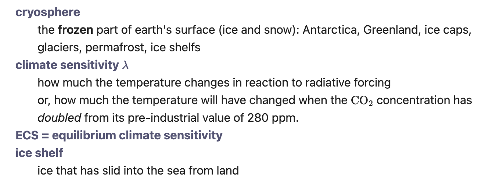
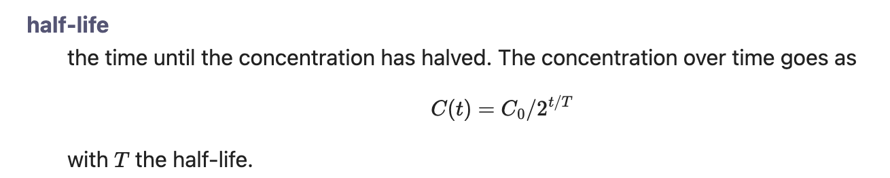
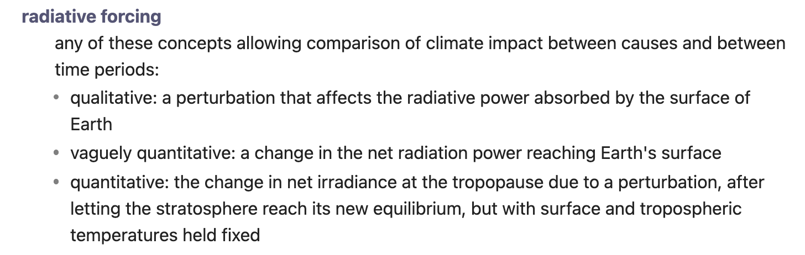

## Definition list

Create a Definition list, like the `<dl>` element in HTML. This is a reduced and slightly modified form of the functionality for definition lists of the PHP [Markdown Extra](https://michelf.ca/projects/php-markdown/extra/#def-list) module.

### Usage
A definition list consists of one or more *term* – *definition* pairs. The term should be entered at the left of the line. The definition must then be entered on the next line, in the form of a `:` at the start of the line followed by 3 spaces, followed by the definition:

```
cryosphere
:   the **frozen** part of earth's surface (ice and snow): Antarctica, Greenland, ice caps, glaciers, permafrost, ice shelfs
climate sensitivity $\lambda$
:   how much the temperature changes in reaction to radiative forcing
:   or, how much the temperature will have changed when the $\ce{CO2}$
concentration has *doubled* from its pre-industrial value of 280 ppm.
ECS = equilibrium climate sensitivity
ice shelf
:   ice that has slid into the sea from land
```

The plugin displays this as a definition list:



Multiple consecutive definition lines are allowed (as in the second item of the example), and consecutive terms are allowed too (as in the last item).

### Start and end of definition list
A definition list is a block of lines that has at least one definition marker (the <code>:&nbsp;&nbsp;&nbsp;</code>  at the start of the line). It ends at the place of any header, horizontal line, table, blank line, formula block, and so on – the only exception is a *list* (bulleted or numbered), which doesn't end the definition-list block but is absorbed into it.

For example, to continue the definition list below a formula, there should be definition markers somewhere above and below it:

```
half-life
:   the time until the concentration has halved. The concentration over time goes as
$$
C(t) = C_0 / 2^{t/T}
$$
:   with $T$ the half-life.
```

Here, the final line is not part of the original definition list, which ends where the block formula starts, but of a new definition list.



A list (bulleted or numbered) immediately following a definition is taken to be part of the definition. The list gets indented to the level of the definition (normally a bit deeper than the standard list-item indentation). Thus,

```
radiative forcing
:   any of these concepts allowing comparison of climate impact between causes and between time periods:
* qualitative: a perturbation that affects the radiative power absorbed by the surface of Earth
* vaguely quantitative: a change in the net radiation power reaching Earth's surface
* quantitative: the change in net irradiance at the tropopause due to a perturbation, after letting the stratosphere reach its new equilibrium, but with surface and tropospheric temperatures held fixed
```

is rendered as



For a complete definition of the syntax, see the file `doc/Specifications.md` in the Github repository of the plugin.

### Settings
You can configure the formatting of terms and their definitions on the Settings page of the plugin.
